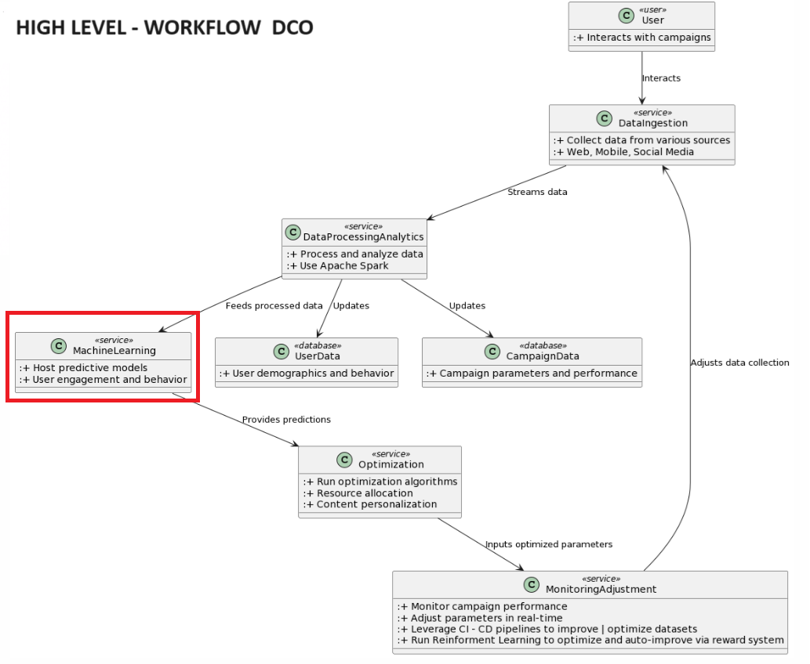
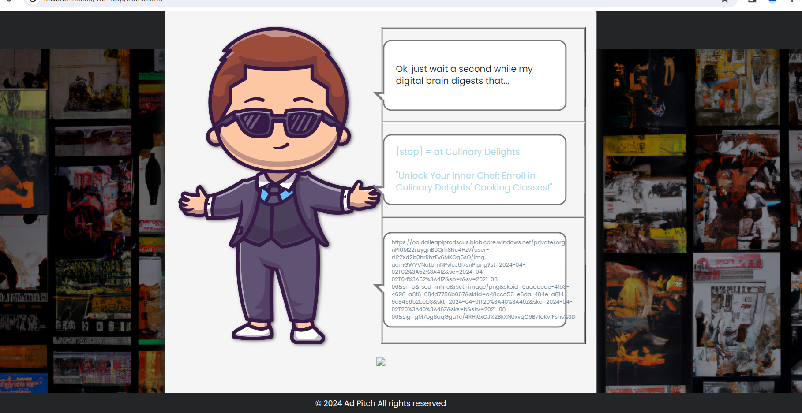
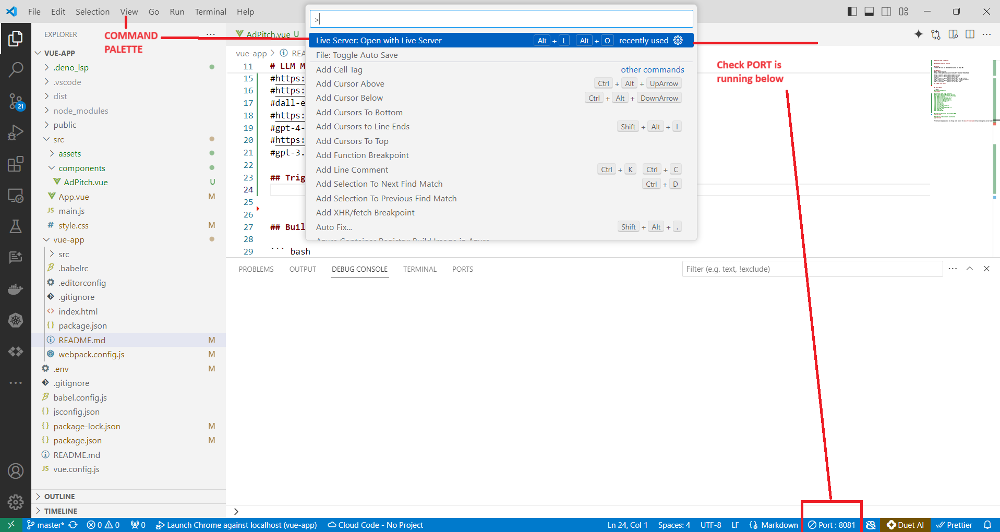

# Workflow - Dynamic Creative Optimization


This example will focus on exercise the component/service related to MachineLearning.


# Download Code from GitHub
https://github.com/oldbright22/vue-app


# Checkout LIVE Video - How it works


# vue-app
> This app intends to demonstrate how to generate images using openAI - Dall-e-3 - Machine Learning Component
>
1> End User will enter a topic (textbox) field at bottom + press submit button

USER entered as Advertising topic = "cooking classes"

2> AI Assistant Tim, will generate an Advertising Title and URL Image related to the topic provided


Example of Image URL produced


# LLM Models
#Check MigrationOpen AI
#https://chat.openai.com/share/b175130a-0d77-465e-8187-59b92590df8b

#https://platform.openai.com/docs/models/overview
#https://platform.openai.com/docs/models/dall-e
#dall-e-3             - Latest as of NOV-2023
#https://platform.openai.com/docs/models/gpt-4-and-gpt-4-turbo
#gpt-4-0125-preview   - Latest as of DEC-2023  (*requires payment) 
#https://platform.openai.com/docs/models/gpt-3-5-turbo
#gpt-3.5-turbo-0125   - Latest as of SEP-2021  FREE


### INSTALLATION STEPS


## Installation Vue
Follow recommended steps per video
https://www.youtube.com/watch?v=P4BmSvAry-c

For detailed explanation on how things work, consult the [docs for vue-loader](http://vuejs.github.io/vue-loader).


## Build Setup

``` bash
# install dependencies
npm install

# all below needs to be installed
#PS C:\Users\btina\LLM\vue-app> npm list
#vue-app@0.1.0 C:\Users\btina\LLM\vue-app
#├── @babel/core@7.24.0
#├── @babel/eslint-parser@7.23.10
#├── @vue/cli-plugin-babel@5.0.8
#├── @vue/cli-plugin-eslint@5.0.8
#├── @vue/cli-service@5.0.8
#├── axios@1.6.8
#├── core-js@3.36.0
#├── dotenv@16.4.5
#├── eslint-plugin-vue@8.7.1
#├── eslint@7.32.0
#├── install-webpack-plugin@4.0.6
#├── openai@4.28.4
#├── vue@3.4.21
#└── webpack@5.90.3

```

## Trigger Live Server



## NPM run or build
```
# serve with hot reload at localhost:8080
npm run serve

# build for production with minification
npm run build
```